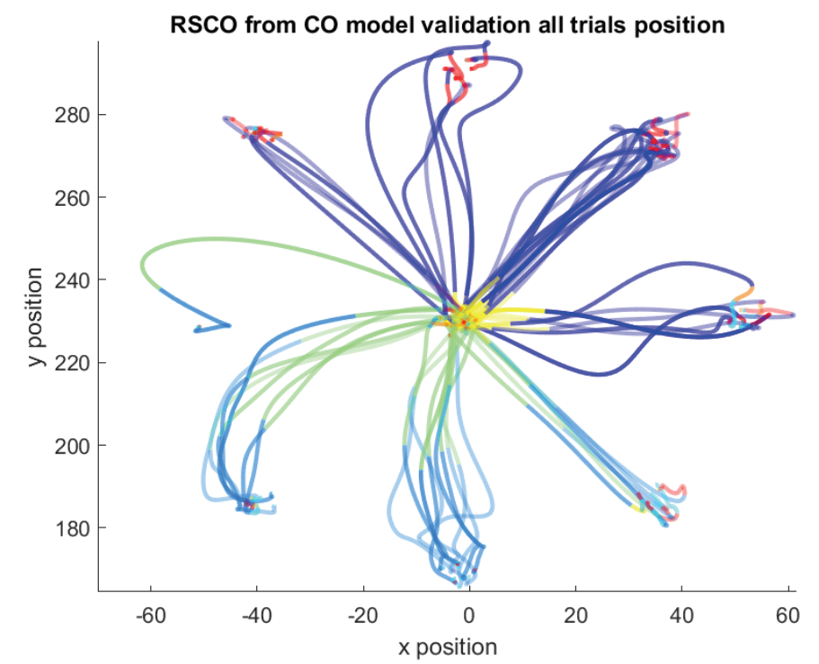
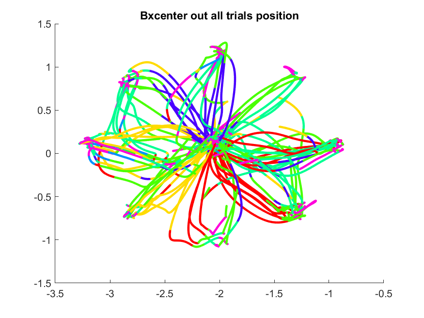

# Caleb Sponheim Dissertation Documentation

**This document is meant to be presented largely in chronological format, to document my analysis efforts and share them with other interested parties.**

---

## Summary of the work so far

### Replication Efforts

#### Matlab Replication

Using the same algorithmic "core" as Naama Kadmon Harpaz, I wrote my own code to process, format, and input the data into the non-parametric Hidden Markov Model. I also wrote code to export, format, and analyze the hidden state decoding results to decompose kinematic variables.

My initial goal was to replicate the results published in Kadmon Harpas et al (2019), using the exact data and methods and described in the paper. I also gathered my own data and attempted to replicate those results as well.

Results to add in this section:

1. AIC and Log-Likelihood results from RS / RJ
    Raju AIC: 
    
    Rockstar AIC: 
    
2. Center out and RTP results (respectively) with optimal states for RS and RJ, from Caleb Matlab Analysis.
    
    
3. Breaux Log Likelihood and AIC results
    
    

### Python Replication

Due to feedback from my thesis committee AND Naama, I was encouraged to explore more realistic switching models of neural activity. I spoke with Ken Latimer of the Freedman lab about this, and he recommended [Scott Linderman's models and toolbox.](https://github.com/lindermanlab/ssm)

The toolbox "called 'ssm' by the github repository" contains a multitude of different ways of modeling switching dynamics for time series data. The most basic version of these models is approximately the same type as was implemented in Kadmon Harpaz (2019), a Hidden Markov Model.

The difference between this HMM implementation and Naama's is two-fold:

1. The linderman group's HMM is parametric; that means the emission probabilities are modeled not by estimating the probabilities of each individual possible value with in the range of emissions, but by assuming that the emissions have some sort of distribution *a priori*. This provides the benefit of fewer parametrs to fit, but requires an assumption about the distribution of the data.
2. As far as I can tell, The Liderman Group's HMMs don't take in multiple trials. As such, I am required to input a concatonated string of spike counts instead of one trial at a time.

As such, I wanted to make sure that the movement decomposition that we observe using Naama's method could be recovered using this similar but slightly different HMM method.

Results to add in this section:

1. Bx example of movement decoding from python

    BX example:
    
2. Bx example of AIC from python

    

## Future Directions

### Taka Strategy

### Dynamic Modeling
